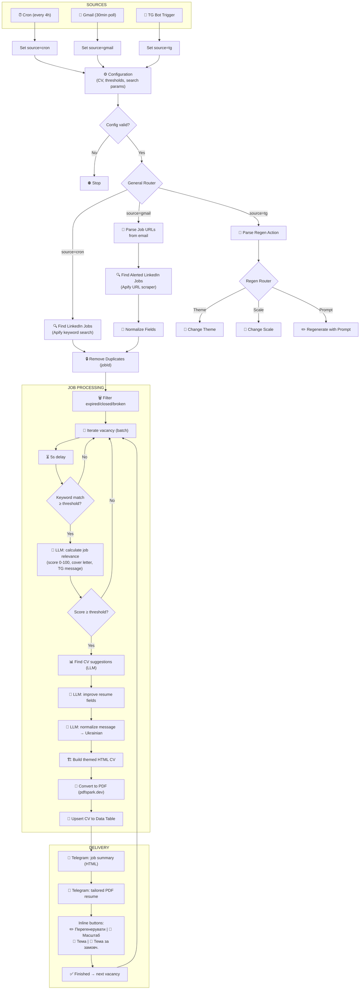

# 🎯 Job Detector — Automated LinkedIn Job Search with AI-Powered CV Generation

An automated n8n workflow that searches, analyzes, and scores LinkedIn vacancies, sends personalized notifications to Telegram, and generates tailored PDF resumes for each high-scoring job — all with an interactive Telegram bot for on-the-fly CV customization.

## Table of Contents

- [How It Works](#how-it-works)
- [Architecture](#architecture)
- [Features](#features)
- [Installation](#installation)
- [Credentials Setup](#credentials-setup)
- [Configuration](#configuration)
- [CV Themes](#cv-themes)
- [Telegram Bot Commands](#telegram-bot-commands)
- [Cost Breakdown](#cost-breakdown)
- [Limitations](#limitations)
- [Strengths](#strengths)

## How It Works

The workflow runs in three parallel modes:

**Mode 1 — Scheduled Scan (every 4 hours):** Scrapes LinkedIn for jobs matching configured keywords and location, filters duplicates, scores each vacancy via LLM, analyzes resume fit, generates a tailored PDF resume, and sends everything to Telegram.

**Mode 2 — Gmail Trigger (every 30 minutes):** Polls for unread LinkedIn Job Alert emails, extracts job URLs, scrapes job details via a separate Apify actor, normalizes the data into a unified format, and feeds it into the same processing pipeline.

**Mode 3 — Telegram Bot (real-time):** Listens for callback actions from Telegram inline buttons. Allows the user to regenerate a CV with a custom prompt, change the CV theme, or adjust the PDF scale — all from within the Telegram chat.

All three modes converge at a centralized **Configuration** node that holds every tunable parameter: CV data, search criteria, thresholds, templates, and PDF options.

## Architecture



## Features

**Search & Collection:**
- Automated search across customizable keywords (configured in the Configuration node)
- Gmail polling for instant processing of LinkedIn Job Alert emails (every 30 min)
- Deduplication of jobs between runs (remembers processed jobIds)
- Deduplication of email messages (marks as read after processing)
- Keyword matching — automatic comparison of job stack vs your resume keywords
- Filters out expired, closed, offline, and paused job listings
- Filters out broken listings with no description

**AI Analysis:**
- Job relevance scoring from 0 to 100 via LLM (Gemini Flash)
- Personalized cover letter generation in Ukrainian (for score ≥ 85)
- Resume gap analysis — skill gaps, ATS compatibility, improvement actions
- LLM-driven resume improvement — rephrases experience bullets to include ATS keywords
- Translation and normalization of all messages to Ukrainian

**CV Generation:**
- Automatic tailored PDF resume for each qualifying job
- 11 themed HTML→PDF templates (Classic, Anthropic, Gemini, ChatGPT, DeepSeek, Grok, Perplexity, VSCode, React, Behance, Figma)
- Locked/modifiable field split — name, contact, education stay fixed; headline, summary, experience, skills are optimized per job
- CV storage in n8n Data Table for later regeneration
- PDF conversion via pdfspark.dev API with configurable A4 options

**Telegram Bot:**
- HTML-formatted job notifications with clickable links
- PDF resume attached to each notification
- Inline buttons: Regenerate (with custom prompt), Scale, Theme, Default Theme
- Interactive conversation flow: the bot asks for input, waits, and applies changes
- Regenerated CVs are re-sent as new PDF documents

**Filtering:**
- Pre-filter by keyword match (configurable threshold, default < 33% → skipped without LLM call, saves tokens)
- Score-based filter (configurable threshold, default < 85 → no CV analysis or notification)
- Status-based filter (expired/closed/offline/paused → skipped)

## Installation

**Prerequisites:**
- n8n instance (self-hosted or n8n cloud)
- Accounts: Apify, Google Cloud (Gemini API), Telegram Bot
- Gmail account with LinkedIn Job Alerts configured
- An n8n Data Table named `cv_store` with columns: `label`, `htmlContent`, `resumeJson`, `company`, `theme`

**Import the workflow:**

1. Download `Job_Detector__23_.json` from this repository
2. In n8n, go to **Settings → Import from File**
3. Select the JSON file
4. The workflow will appear as "Job Detector"

Or via CLI:
```bash
n8n import:workflow --input=job_detector.json
```

**Post-import steps:**

1. Open the workflow and configure credentials for all nodes with an orange indicator
2. Open the **Configuration** node and replace all personal data (CV, chat ID, search criteria)
3. Create the `cv_store` Data Table in your n8n project and link it in the **Upsert CV's content** node

## Credentials Setup

After import, configure credentials for each service. Open the workflow and check nodes with the orange missing-credentials indicator.

### 1. Apify OAuth2 API

Used in 2 nodes: **Find LinkedIn Jobs**, **Find Alerted LinkedIn Jobs**.

1. Register at [apify.com](https://apify.com)
2. Go to **Settings → Integrations → API tokens**
3. Create a new token
4. In n8n: **Credentials → New → Apify OAuth2 API** → paste the token

**Apify actors used:**
- `2rJKkhh7vjpX7pvjg` — LinkedIn Jobs Scraper (keyword-based search)
- `HxVzxLvPwxYkc6ndm` — LinkedIn Jobs Scraper - Professional Job Listings (URL-based detail scraping)

### 2. Google Gemini (LLM)

Used in 4+ Gemini model nodes throughout the workflow.

1. Go to [Google AI Studio](https://aistudio.google.com/apikey)
2. Create an API key
3. In n8n: **Credentials → New → Google Gemini API** → paste the key
4. Default model: `gemini-3.1-flash-lite` (fast and cheap, but you can choose another)

### 3. Telegram Bot

Used in multiple nodes: **Send a text message**, **Send a document to TG**, **TG: Regen Trigger**, and all interactive prompt/response nodes.

1. Message [@BotFather](https://t.me/BotFather) in Telegram
2. Create a new bot: `/newbot`
3. Copy the bot token
4. Find your Chat ID — message [@userinfobot](https://t.me/userinfobot)
5. In n8n: **Credentials → New → Telegram API** → paste the token
6. In the **Configuration** node, set `tg_chat_id` to your Chat ID

### 4. Gmail OAuth2

Used in nodes: **Get many messages**, **Mark a message as read**.

1. Create OAuth2 credentials in [Google Cloud Console](https://console.cloud.google.com/apis/credentials)
2. Enable the Gmail API
3. In n8n: **Credentials → New → Gmail OAuth2 API** → complete the OAuth flow
4. Make sure you have LinkedIn Job Alerts enabled and arriving in your inbox

### 5. PDF Service

The workflow uses `https://pdfspark.dev/api/v1/pdf/from-html` for HTML→PDF conversion. This is called via HTTP Request nodes (**Make a PDF**, **Rescale: Make PDF**). Check if pdfspark.dev requires an API key and configure it in the HTTP Request node headers if needed.

## Configuration

All settings live in the **Configuration** node — a single Set node with a JSON object. Open it and customize:

### Telegram Chat ID

```json
"tg_chat_id": 123456789
```
Replace with your own Chat ID.

### Score Threshold

```json
"score_threshold": 85
```
Minimum LLM relevance score for a job to trigger CV analysis and notification. Jobs scoring below this are silently skipped.

### Keyword Match Threshold

```json
"keyword_match_threshold": 33
```
Minimum keyword match percentage for a job to be sent to the LLM at all. Jobs below this threshold are skipped without consuming LLM tokens.

### Search Keywords

```json
"linkedin_job_search_criterias": {
  "keyword": [
    "React Native",
    "Full Stack",
    "Node.js",
    "JavaScript",
    "TypeScript",
    "Front End"
  ],
  "location": "Kyiv, Ukraine",
  "maxItems": 150,
  "publishedAt": "r86400",
  "resumeKeywords": [
    { "keyword": "JavaScript", "aliases": ["JS"] },
    { "keyword": "TypeScript", "aliases": ["TS"] },
    { "keyword": "Node.js", "aliases": ["Node", "NodeJS"] },
    { "keyword": "React Native", "aliases": ["RN"] },
    { "keyword": "React" },
    { "keyword": "Expo" }
  ],
  "saveOnlyUniqueItems": true
}
```

- `keyword` — search terms sent to LinkedIn
- `location` — target job location
- `maxItems` — maximum results per scraper run
- `publishedAt` — time window (`r86400` = last 24 hours, `r43200` = last 12 hours)
- `resumeKeywords` — your skill keywords for automatic stack matching; `aliases` let you catch variations

### Candidate CV

```json
"candidate_raw_cv": {
  "full_name": "YOUR NAME",
  "headline": "Your headline",
  "contact": { "phone": "...", "email": "...", "linkedin": "...", "location": "..." },
  "summary": "Your summary...",
  "experience": [ ... ],
  "education": [ ... ],
  "languages": [ ... ],
  "achievements": [ ... ],
  "skills": [ ... ]
}
```
Replace the entire object with your own CV data. This is used for LLM scoring, cover letter generation, resume improvement, and PDF generation. The structure must be preserved — the workflow splits it into locked fields (`full_name`, `contact`, `education`, `languages`, `achievements`) and modifiable fields (`headline`, `summary`, `experience`, `skills`).

### Candidate Experience Level

```json
"candidate_experience_level": "mid"
```
Used by the LLM to calibrate scoring. Options: `junior`, `mid`, `senior`.

### CV Theme

```json
"cv_theme": "chatgpt"
```
Default theme for generated resumes. See [CV Themes](#cv-themes) for all options.

### PDF Options

```json
"pdf_options": {
  "format": "A4",
  "printBackground": true,
  "emulateMediaType": "screen",
  "margin": { "top": "0mm", "right": "0mm", "bottom": "0mm", "left": "0mm" }
}
```

> **Tip:** Change `"emulateMediaType"` to `"print"` to make templates more printer-friendly. The output will look a bit duller (muted colors, simplified backgrounds) but is better suited for physical printing.

### Message Template

The `message_template` field contains the HTML template for Telegram notifications. Placeholders like `[Job Title]`, `[Company Name]`, `[Score]` are replaced by the LLM normalization step.

## CV Themes

The workflow includes 11 visual themes for PDF resumes, each implemented as a standalone HTML builder node:

| Theme | Style |
|-------|-------|
| `classic` | Clean, traditional resume layout |
| `anthropic` | Inspired by Anthropic's brand aesthetic |
| `gemini` | Google Gemini-inspired design |
| `chatgpt` | OpenAI ChatGPT-inspired design |
| `deepseek` | DeepSeek-inspired design |
| `grok` | xAI Grok-inspired design |
| `perplexity` | Perplexity AI-inspired design |
| `vscode` | VS Code editor-inspired light theme |
| `react` | React.js documentation-inspired design |
| `behance` | Behance portfolio-inspired creative layout |
| `figma` | Figma-inspired design tool aesthetic |

Set the default theme in the Configuration node (`cv_theme` field), or change it per-CV via the Telegram bot's theme picker.

## Telegram Bot Commands

After receiving a job notification with an attached PDF resume, the user sees inline buttons:

| Button | Action |
|--------|--------|
| ✏️ Перегенерувати | Enter a custom prompt (e.g., "emphasize backend experience") and the LLM regenerates the resume accordingly |
| 📐 Масштаб | Adjust the PDF scale factor (useful if content overflows one page) |
| 🎨 Тема | Switch to a different CV theme for this specific resume |
| 🔄 Тема за замовч. | Change the default theme used for all future resumes |

The bot uses n8n's **Wait** nodes to pause execution and wait for user input, creating an interactive conversational flow entirely within Telegram.

## Cost Breakdown

| Service | Cost | Notes |
|---------|------|-------|
| LinkedIn Jobs Scraper (keyword search) | ~$0.60 / 1,000 jobs | ~20-30 jobs per query |
| LinkedIn Jobs Scraper (URL detail) | ~$2 / 1,000 jobs | Limited to 1 job per request |
| Google Gemini Flash Lite | Free tier | Multiple LLM calls per qualifying job |
| pdfspark.dev | Check pricing | HTML→PDF conversion |
| Telegram | Free | Bot API |
| Gmail | Free | OAuth2 API |

At 6 runs per day (every 4 hours) with the Gmail trigger running every 30 minutes: approximately **~$0.10-0.15/day** or **~$3-5/month** on Apify.

To reduce costs: use fewer search keywords, increase the cron interval, lower `maxItems`, use `publishedAt: "r43200"` (12 hours instead of 24), or raise the `keyword_match_threshold` to send fewer jobs to LLM.

## Limitations

- **Single user.** The workflow is designed for one candidate. The Configuration node holds one CV and one chat ID.
- **LinkedIn scraping dependency.** Relies on Apify actors which may break if LinkedIn changes its page structure.
- **pdfspark.dev dependency.** PDF generation depends on an external API. If it goes down, CVs won't be generated.
- **No persistent job deduplication across workflow versions.** Deduplication relies on n8n's built-in Remove Duplicates node which tracks within execution scope. If you reimport the workflow, previously seen jobs may reappear.
- **Gmail polling, not push.** The Gmail source polls every 30 minutes, so there can be up to a 30-minute delay for email-triggered jobs.
- **Rate limiting is basic.** A 5-second delay between job iterations. Heavy runs with many qualifying jobs may take significant time.
- **LLM hallucination risk.** Cover letters and resume improvements are generated by LLM. Review before sending to employers.
- **Data Table coupling.** The CV regeneration flow requires an n8n Data Table (`cv_store`) to be created and linked manually.

## Strengths

- **End-to-end automation.** From job discovery to tailored resume delivery — fully hands-off for the daily flow.
- **Centralized configuration.** Everything in one node — easy to understand, modify, and maintain.
- **Smart cost optimization.** Two-stage filtering (keyword match → LLM score) avoids wasting tokens on irrelevant jobs.
- **Tailored resumes at scale.** Each qualifying job gets a purpose-built CV with ATS-optimized keywords, not a generic one.
- **Interactive Telegram bot.** Regenerate, restyle, and rescale CVs without opening n8n or any other tool.
- **11 visual themes.** Professional variety for different industries and personal taste.
- **Dual input sources.** Cron-based search catches broad results; Gmail alerts catch jobs matching LinkedIn's own recommendation engine.
- **Ukrainian localization.** All messages, cover letters, and notifications are automatically translated to Ukrainian.
- **Validation gate.** The workflow validates configuration on every run and stops early if required fields are missing.
- **CV versioning via Data Table.** Previously generated resumes are stored and can be regenerated or restyled without re-running the full pipeline.


# 📰 News Feed Automation

Автоматизований n8n-воркфлоу, який щоранку збирає статті з RSS-стрічок, створює короткі українськомовні анотації за допомогою Google Gemini і публікує їх у Telegram-канал із зображеннями.

---

## Архітектура

```
┌───────────────┐      ┌───────────┐      ┌──────────┐       ┌─────────────┐
   Schedule       ───▶   URL List   ───▶   Split Out   ───▶    RSS Read   
   (10:00 AM)            (9 feeds)        └──────────┘       └──────┬──────┘                        
└───────────────┘      └───────────┘                                |
                                                                    │
                    ┌───────────────────────────────────────────────┘
                    ▼
             ┌─────────────┐        ┌───────────┐        ┌──────────┐      ┌──────────────────┐
               Filter fresh   ───▶    Randomize   ───▶    Limit 15   ───▶  Remove Duplicates
               (this year)          └───────────┘        └───────────┘       (cross-execution)
             └─────────────┘                                               └───────┬──────────┘
                                                                                   │
                    ┌──────────────────────────────────────────────────────────────┘
                    ▼
          ┌──────────────────┐      ┌──────────────────┐       ┌─────────────┐
            Loop Over Items    ───▶     Wait 5s (rate    ───▶   Gemini 2.5  
             (batch by 1)               limit between             Flash LLM   
          └────────┬─────────┘           iterations)             (summarize) 
                   |                └────────┬─────────┘       └──────┬──────┘
                   ▲                                                  │
                   │                                                  ▼
          ┌────────┴─────────┐                                ┌──────────────┐
             Send Photo       ◀─────────────────────────────     Map Images  
             to Telegram                                         (fallbacks) 
          └──────────────────┘                                └──────────────┘
```

---

## Що робить воркфлоу

1. **Тригер за розкладом** — запускається щодня о 10:00.
2. **Збір RSS** — обходить 9 RSS-стрічок (tech, AI, українські медіа).
3. **Фільтрація** — залишає лише статті поточного року.
4. **Рандомізація + ліміт** — перемішує та обрізає до 15 статей.
5. **Дедуплікація** — прибирає статті, які вже надсилались у попередніх запусках (за ключем `creator + link`).
6. **LLM-саммарі** — Gemini 2.5 Flash генерує коротку анотацію українською (до 1024 символів, Telegram HTML).
7. **Підбір зображення** — бере `enclosure.url` зі статті або підставляє фолбек-логотип за доменом.
8. **Публікація** — надсилає фото з підписом у Telegram-чат.
9. **Rate limiting** — між ітераціями 5-секундна пауза, щоб не потрапити в ліміти API.

---

## RSS-джерела

| Джерело | URL |
|---------|-----|
| Hacker News (frontpage) | `https://hnrss.org/frontpage` |
| DEV.to | `https://dev.to/feed/` |
| OpenAI Blog | `https://openai.com/news/rss.xml` |
| Google DeepMind Blog | `https://deepmind.google/blog/rss.xml` |
| CSS-Tricks | `https://css-tricks.com/feed/` |
| AIN.UA | `https://ain.ua/feed/` |
| ITPro | `https://www.itpro.com/feeds.xml` |
| ITC.UA | `https://itc.ua/ua/feed/` |
| УНІАН | `https://rss.unian.net/site/news_ukr.rss` |

---

## Вимоги

- **n8n** — self-hosted або n8n Cloud
- **Google Gemini API** — ключ для моделі `gemini-2.5-flash`
- **Telegram Bot** — токен бота + ID чату для публікації

---

## Налаштування

### 1. Імпорт воркфлоу

1. Відкрийте n8n → **Workflows** → **Import from File**.
2. Завантажте JSON-файл воркфлоу.

### 2. Credentials

Потрібно створити два credentials у n8n:

**Google Gemini:**
- Перейдіть до **Settings** → **Credentials** → **New Credential**.
- Тип: `Google Gemini Chat Model`.
- Вставте ваш API-ключ Google AI Studio.

**Telegram Bot:**
- Тип: `Telegram API`.
- Вставте токен бота (отримайте через [@BotFather](https://t.me/BotFather)).

### 3. Налаштування чату Telegram

У ноді **"Send a post to TG"** замініть `chatId` на ID вашого каналу або чату

### 4. Кастомізація джерел

Відредагуйте масив URL-адрес у ноді **"Url sources"**. Додайте або видаліть RSS-стрічки за потреби.

### 5. Активація

Увімкніть воркфлоу тумблером — він запускатиметься автоматично щодня о 10:00.

---

## Структура нод

| Нода | Тип | Призначення |
|------|-----|-------------|
| Call every morning (10AM) | Schedule Trigger | Щоденний запуск |
| Url sources | Set | Масив RSS-стрічок |
| Split Out | Split Out | Розгортає масив в окремі items |
| RSS Read | RSS Feed Read | Зчитує статті з кожного RSS |
| Pick fresh posts | Filter | Фільтрує за поточним роком |
| Randomize | Sort (random) | Перемішує статті |
| Limit to 15 | Limit | Обмежує кількість |
| Remove Duplicates | Remove Duplicates | Виключає раніше надіслані |
| Loop Over Items | Split In Batches | Обробка по одній статті |
| If not the first iteration | If | Пропускає паузу для першої |
| Wait 5 seconds | Wait | Пауза між публікаціями |
| LLM: process a post | Chain LLM | Генерація анотації (Gemini) |
| Google Gemini Chat Model | LM Chat | Модель для LLM-ноди |
| Map images | Code | Вибір зображення або фолбеку |
| Send a post to TG | Telegram | Публікація в Telegram |

---

## Формат повідомлення у Telegram

Кожна публікація надсилається як фото з HTML-підписом:

```
<b>Заголовок статті</b>

<i>Автор:</i> Ім'я
<i>Дата:</i> 17.05.2026
<i>Категорія:</i> AI, Machine Learning

Коротка анотація українською — 2-3 речення
про що стаття та чому може бути корисна.

<a href="https://...">Читати повністю</a>
```

---

## Фолбек-зображення

Якщо стаття не містить `enclosure.url`, підставляється логотип джерела:

| Домен | Фолбек |
|-------|--------|
| openai.com | Логотип OpenAI |
| deepmind.google | Логотип DeepMind |
| ain.ua | Логотип AIN |
| itc.ua | Логотип ITC |
| dev.to | Логотип DEV |
| css-tricks.com | Логотип CSS-Tricks |
| itpro.com | Логотип ITPro |
| unian.net | Логотип УНІАН |
| (інше) | Стокова картинка новин |

---

## Можливі проблеми

- **RSS недоступний** — нода RSS Read має `onError: continueRegularOutput`, тому один збій не зупиняє весь воркфлоу.
- **Gemini rate limit** — 5-секундна пауза між ітераціями мінімізує ризик, але при великій кількості публікацій збільшіть паузу.
- **Telegram rate limit** — Telegram обмежує ботів до ~30 повідомлень на секунду; 15 повідомлень з паузами не повинні викликати проблем.
- **Фолбек-зображення недоступне** — замініть URL у ноді "Map images" на альтернативне.

---


# 🛒 AliExpress Scraper via Apify

Автоматизований n8n-воркфлоу, який щотижня скрапить товари з AliExpress через Apify, нормалізує дані та публікує картки товарів у Telegram із цінами, знижками та рейтингами.

---

## Архітектура

```
┌────────────────┐      ┌─────────────────────┐
 Schedule Trigger  ───▶       Apify Actor         
   (Sat 12:00)            (AliExpress Scraper) 
└────────────────┘      └──────────┬───────────┘
                                   │
                       ┌───────────┴───────┐
                       │                   │
                    success              error
                       │                   │
                       ▼                   ▼
              ┌─────────────────┐  ┌──────────────────┐
               Remove Duplicates     Send error alert  
                 (by productId)        to Telegram       
              └────────┬────────┘  └──────────────────┘
                       │
                       ▼
              ┌─────────────────┐
                 Normalize Data  
                  (Code node)     
              └────────┬────────┘
                       │
                       ▼
              ┌─────────────────┐
                Send photo msg   
                  to Telegram      
              └─────────────────┘
```

---

## Що робить воркфлоу

1. **Тригер за розкладом** — запускається щосуботи о 12:00.
2. **Скрапінг** — Apify actor `mfblss3fLQRaqhg6K` шукає товари за запитами (`fpv`, `graphic cards`, `LiPo`, `vtx`), сортуючи за рейтингом, до 10 товарів на запит.
3. **Обробка помилок** — якщо актор впав після 3 ретраїв, у Telegram надсилається алерт з деталями помилки.
4. **Дедуплікація** — видаляє дублікати за `productId`.
5. **Нормалізація** — Code-нода трансформує сирі дані Apify в чистий формат: ціна, знижка, рейтинг, зображення, купони тощо.
6. **Публікація** — кожен товар надсилається у Telegram як фото з HTML-підписом.

---

## Пошукові запити

За замовчуванням воркфлоу шукає:

| Запит | Опис |
|-------|------|
| `fpv` | FPV-дрони та комплектуючі |
| `graphic cards` | Відеокарти |
| `LiPo` | LiPo-акумулятори |
| `vtx` | Відеопередавачі для FPV |

Щоб змінити запити, відредагуйте масив `queries` у ноді **"Run an Actor and get dataset"**.

---

## Вимоги

- **n8n** — self-hosted або n8n Cloud
- **Apify** — акаунт + OAuth2 credentials (або API-токен)
- **Telegram Bot** — токен бота + ID чату

---

## Налаштування

### 1. Імпорт воркфлоу

1. Відкрийте n8n → **Workflows** → **Import from File**.
2. Завантажте JSON-файл воркфлоу.

### 2. Credentials

**Apify:**
- Перейдіть до **Settings** → **Credentials** → **New Credential**.
- Тип: `Apify OAuth2 API`.
- Авторизуйтесь через Apify або вставте API-токен з [Apify Console](https://console.apify.com/account#/integrations).

**Telegram Bot:**
- Тип: `Telegram API`.
- Вставте токен бота (отримайте через [@BotFather](https://t.me/BotFather)).

### 3. Налаштування Telegram Chat ID

Заповніть `chatId` у двох нодах:

- **"Send a photo message"** — основні публікації товарів.
- **"Send an error message"** — алерти про помилки.

Щоб дізнатися ID:
- Надішліть повідомлення боту.
- Зробіть запит: `https://api.telegram.org/bot<TOKEN>/getUpdates`.
- Знайдіть `chat.id` у відповіді.

### 4. Налаштування пошуку

У ноді **"Run an Actor and get dataset"** відредагуйте `customBody`:

```json
{
  "deduplicateProducts": true,
  "includeDescription": true,
  "includeQuestions": false,
  "includeReviews": false,
  "includeShippingDetails": false,
  "includeVariants": false,
  "maxItems": 10,
  "queries": ["fpv", "graphic cards", "LiPo", "vtx"],
  "sortBy": "rating"
}
```

| Параметр | Опис |
|----------|------|
| `maxItems` | Макс. кількість товарів на запит |
| `queries` | Масив пошукових запитів |
| `sortBy` | Сортування: `rating`, `price`, `orders` |
| `includeDescription` | Включити опис товару |
| `includeReviews` | Включити відгуки (збільшує час) |

### 5. Активація

Увімкніть воркфлоу — він запуститься автоматично щосуботи о 12:00.

---

## Структура нод

| Нода | Тип | Призначення |
|------|-----|-------------|
| Schedule Trigger | Schedule Trigger | Щотижневий запуск (субота, 12:00) |
| Run an Actor and get dataset | Apify | Запуск скрапера AliExpress |
| Remove Duplicates | Remove Duplicates | Дедуплікація за `productId` |
| Normalize Data | Code | Трансформація в чистий формат |
| Send a photo message | Telegram | Публікація картки товару |
| Send an error message | Telegram | Алерт про помилку скрапера |

---

## Формат повідомлення у Telegram

Кожен товар надсилається як фото з підписом:

```
Назва товару

💰 $12.99  $29.99  (-57%)
⭐ 4.8  •  📦 1,234 sold
🏷️ $2 off every $20

🔗 View on AliExpress
```

---

## Нормалізовані поля

Code-нода `Normalize Data` витягує наступні поля:

| Поле | Джерело | Фолбек |
|------|---------|--------|
| `productId` | `d.productId` | `''` |
| `title` | `d.title.displayTitle` | `''` |
| `currentPrice` | `d.prices.salePrice.minPrice` | `d.extractedData.currentPrice` |
| `originalPrice` | `d.prices.originalPrice.minPrice` | `d.extractedData.originalPrice` |
| `discount` | `d.extractedData.discountPercent` | `d.prices.salePrice.discount` |
| `rating` | `d.evaluation.starRating` | `d.extractedData.rating` |
| `totalOrders` | `d.extractedData.totalOrders` | `0` |
| `imageUrl` | `d.image.imgUrl` | `d.images[0].imgUrl` |
| `storeName` | `d.store.storeName` | `''` |
| `coupons` | `d.sellingPoints[].tagContent.tagText` | `''` |

> Якщо Apify змінить схему відповіді, адаптуйте маппінг у цій ноді.

---

## Обробка помилок

- **Retry policy** — нода Apify автоматично ретраїть до 3 разів із паузою 2 секунди.
- **Error output** — при фінальному фейлі дані йдуть у другий вихід → алерт у Telegram з текстом помилки та посиланням на Apify Console.
- **Продовження при помилках** — `onError: continueErrorOutput` дозволяє обробити помилку замість зупинки воркфлоу.

---

## Можливі проблеми

- **Apify credits** — скрапінг витрачає кредити Apify; слідкуйте за балансом.
- **Зміна схеми актора** — якщо автор актора оновить формат, поправте маппінг у `Normalize Data`.
- **AliExpress блокування** — актор може повертати менше результатів при агресивному скрапінгу; зменшіть `maxItems` або збільшіть інтервал.
- **Порожній `chatId`** — не забудьте заповнити ID чату в обох Telegram-нодах.

---

## Ліцензія

MIT — використовуйте, модифікуйте, діліться вільно.
